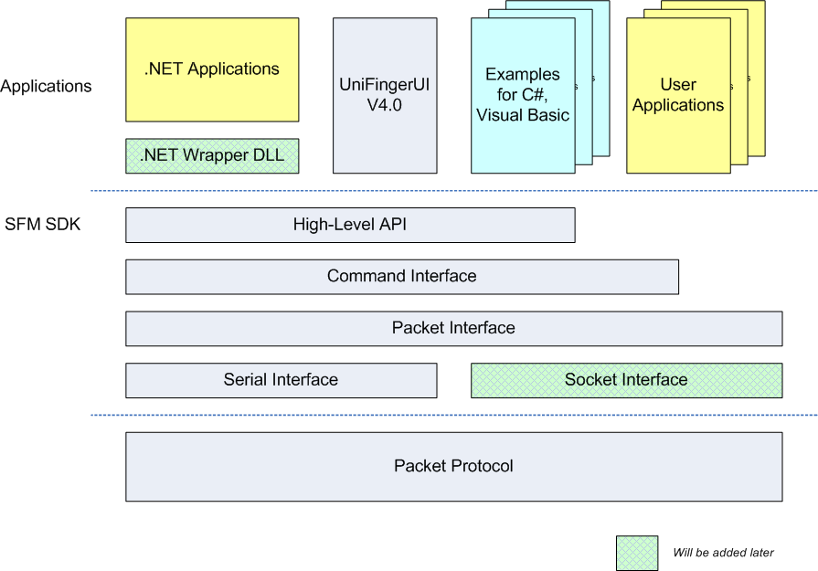
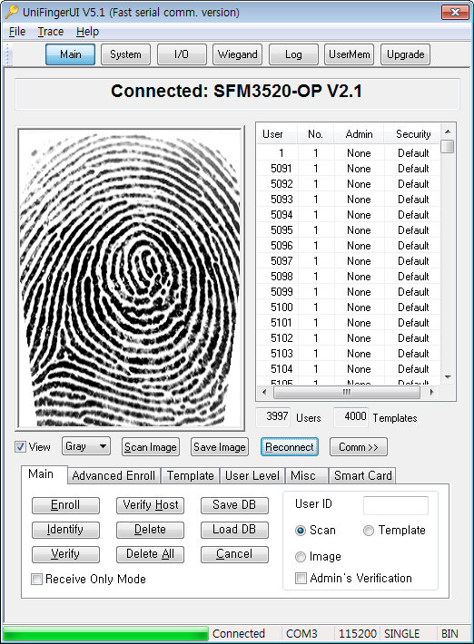

##  1. Introduction

The SFM SDK is a collection of APIs for interfacing with SFM modules and BioEntry readers. In addition to simple wrapper functions for Packet Protocol, it also provides high level APIs such as template DB management, image manipulation, etc. By using the SDK, developers could write Win32 applications quickly without knowing the minute details of Packet Protocol.



**Fig. 1. SFM SDK**

As shown in Fig. 1, the SDK is composed of several layers and developers could choose whichever layer suited for their applications. Another strong point of the SDK is its extensibility. Many of core APIs provide callback mechanism, with which developers can add customized functions. UniFingerUI V5.x is a good example of this feature. Completely rewritten from scratch, UniFingerUI V5.x covers all the core functionalities of SFM modules and shows how to use the SDK in real applications. The source codes of it are also provided in the SDK.

### 1.1. Contents of the SDK

| Directory | Sub Directory | Contents |
| --------- | ------------- | -------- |
| SDK | Document | - SFM SDK Reference Manual   <br> - Packet Protocol Manual |
|     | Include | - Header files of SFM SDK. |
|     | Lib | - SFM_SDK.dll: SDK DLL file.   <br> - SFM_SDK_Debug.dll: SDK DLL with debug information.   <br> - SFM_SDK.lib: import library to be linked with C/C+\+ applications.   <br> - SFM_SDK_Debug.lib: import library to be linked with C/C+\+ applications |
|     | Lib_Ordinal | The functions in these DLLs are exported by ordinal using DEF files. Use these DLLs if you have problem using the SDK in programming languages other than C/C++. |
| UniFingerUI |  | - Source codes   <br> - Visual C+\+ 6.0 project file   <br> - Visual C++ 2010 project file (v.5.1~) |
| Example | C# | - A simple example which shows how to use the SDK in .NET environment |

###  1.2. Usage

##### 1.2.1. Compilation

To call APIs defined in the SFM SDK, ‘UF_API.h’ should be included in the source files and SDK\Include should be added to the include directories. To link user application with the SFM SDK, SFM_SDK.lib should be added to library modules.

The following snippet shows a typical source file.

``` cpp
#include “UF_API.h”
int main()
{
	// First, initialize the serial port
	UF_RET_CODE result = UF_InitCommPort( “COM1”, 115200, FALSE );

	If( result != UF_RET_SUCCESS )
	{
		return -1;
	}

	// Call APIs
	UINT32 userID;
	BYTE subID;

	result = UF_Identify( &userID, &subID );

    // …
}
```
1.2.2. Using the DLL
To run applications compiled with the SFM SDK, the SFM_SDK.dll file should be in the system directory or in the same directory of the application.

###  1.3. UniFinger UI

UniFinger UI is a full-featured application by which users can test all the core functionalities of SFM modules. UniFinger UI is implemented using the SFM SDK and full source codes are available for SDK users.

##### 1.3.1. Optional Requirements
UniFinger UI uses Microsoft’s HTML Help Workshop for online help. You can download it from the MSDN web site.

##### 1.3.2. Compilation
Open UniFingerUI\UniFingerUI.dsw in Microsoft Visual C++ 6.0 or later. If you download and install HTML Help Workshop, changes the include directory and library path accordingly. If you don’t want online help, just select ‘Win32 Debug Without Help’ or ‘Win32 Release Without Help’ as the active configuration.





**Fig. 2. UniFingerUI**